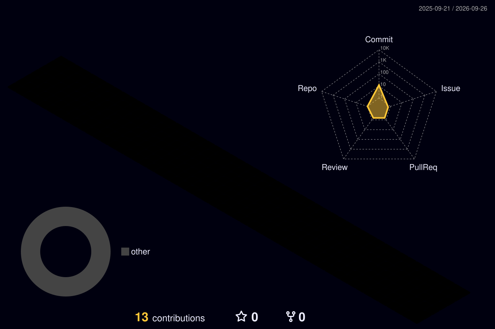

# Kevin Daza
**Civil Engineer · AI Engineer · Full Stack Developer**  
*Turning structural discipline into raw compute, intelligent models, and functional systems.*

  
  
  

 

  

### Systems, Code & Reality

Most people look at civil engineering and software as distant worlds; I treat them as identical optimization problems with different constraints. I take the rigor of physical stress limits, finite elements, and failure margins, and translate it straight into machine learning architectures, automated reasoning pipelines, and resilient backend services.

- **Machine Learning & Python:** Architecting neural systems, custom LLM integrations, predictive inference engines, and mathematical modeling designed to execute, not just theorize.
- **Full Stack Architecture:** Writing end-to-end applications where data layers, APIs, and client interfaces actually communicate without breaking under load.
- **Engineering Mindset:** Hardcore algorithmic efficiency, systemic fault tolerance, and zero patience for fragile design.

### Core Stack

**AI, Math & Core Logic**  

  
  
  
  
  
  

**Full Stack & Infrastructure**  

  
  
  
  
  
  
  

 

  
  

